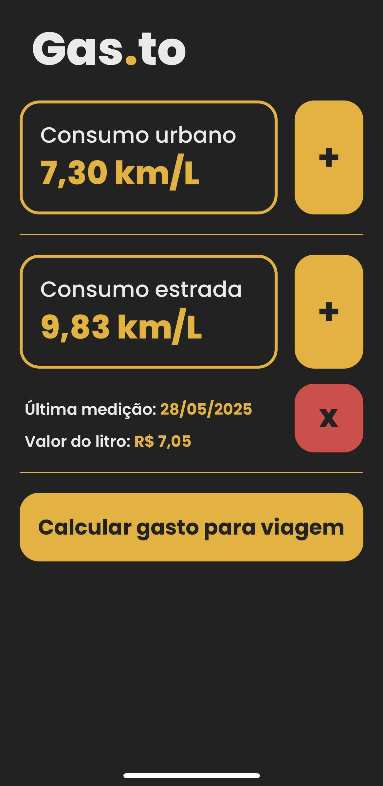
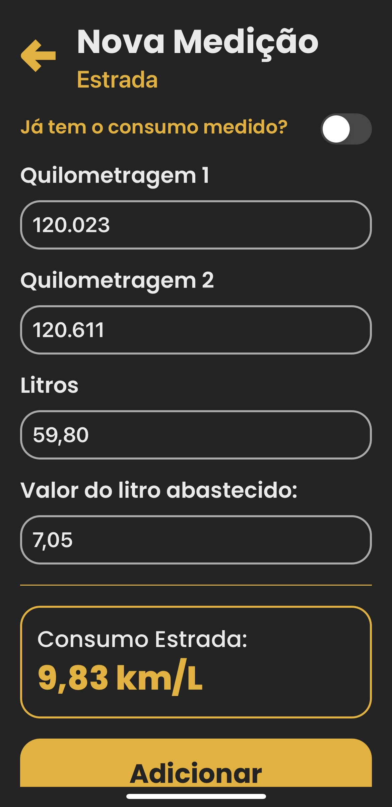
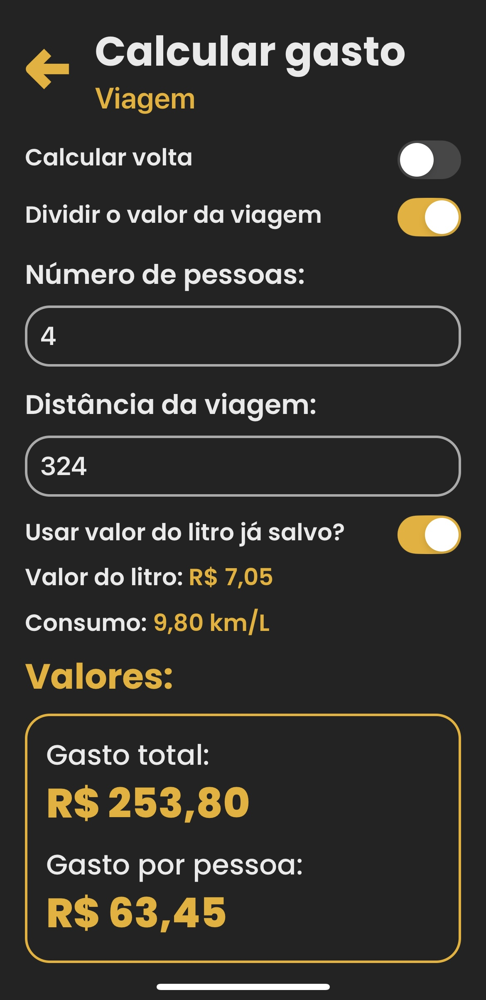

 

<h1>Gas.to</h1>

Gas.to é um aplicativo desenvolvido em React Native usando Expo para auxiliar no controle de consumo de combustível do seu carro, tanto na cidade quanto na estrada. Com ele, você pode calcular os gastos de uma viagem, dividir as despesas com outras pessoas e monitorar a eficiência do seu veículo.

## Funcionalidades

- **Controle de Consumo de Combustível:**
  - Registre o consumo de combustível do seu carro.
  - Diferencie entre consumo na cidade e na estrada.

- **Cálculo de Gasto de Viagem:**
  - Informe a distância da viagem.
  - Registre o consumo médio do carro.
  - Insira o valor do litro da gasolina.
  - Calcule o custo total da viagem.

- **Divisão de Despesas de Viagem:**
  - Calcule a divisão do gasto total entre um número específico de pessoas.
  - Opção para dividir as despesas tanto na ida quanto na volta.

## Tecnologias Utilizadas

- **React Native:** Framework principal para desenvolvimento do aplicativo.
- **Expo:** Ferramenta para visualizar o desenvolvimento com React Native no iOS e Android.
- **JavaScript:** Linguagem de programação utilizada.
####Alguns componentes:
- **React Navigation:** Navegação entre telas.
- **TouchableOpacity:** para a fácil criação de botões.
- **AsyncStorage:** Para armazenar dados localmente.
- **ScrollView:** para visualizar telas mais longas utilizando o scroll.
- **useState, useEffect, useCallback:** para poder renderizar as telas constantemente.
- **Entre outros como:** Image, Switch, TextInput, Alert

## Instalação

Siga os passos abaixo para instalar e executar o projeto localmente:

1. **Clone o repositório:**
   ```
   git clone https://github.com/luigilg/Gas.to
   ```
2. **Navegue até o diretório do projeto:**
    ```
    cd Gas.to
    ```
3. **Instale as dependências:**
    ```
    npm install
    ```
4. **Execute o aplicativo:**
    ```
    npx expo start
    ```

## Uso

  ### Tela inicial
 

  ### Controle de Consumo de Combustível

  #### Registro de Consumo:
  - Acesse a tela de registro.
  - Insira os dados de consumo (quilometragem, litros abastecidos, etc.).
  - Salve as informações para monitoramento contínuo.
 
  <!-- ### Tela de medição de consumo: -->
 
 
  ### Cálculo de Gasto de Viagem
  #### Informar Detalhes da Viagem:
  - Acesse a tela de cálculo de viagem.
  - Insira a distância a ser percorrida.
  - Adicione o consumo médio do carro.
  - Informe o valor do litro de gasolina.
  #### Calcular Custo Total:
  - O aplicativo calculará automaticamente o custo total da viagem.

  #### Divisão de Despesas
  ##### Informar Número de Pessoas:
  - Na tela de cálculo, insira o número de pessoas para dividir o custo.
  - Se necessário, repita o processo para a volta.

  <!-- ### Tela de gasto de viagem: -->
 


## Como calcular o consumo do carro da melhor forma 

#### Para calcular, é ideal que considere os passos a seguir:

1. Encha o tanque e registre a quilometragem indicada no odômetro;
2. Trafegue normalmente até ser necessário abastecer novamente;
3. Registre a quilometragem quando for completar o tanque;
4. Registre quantos litros foram abastecidos para completar.

## Créditos
- Luigi Ledermann Girardi, 2024

#
